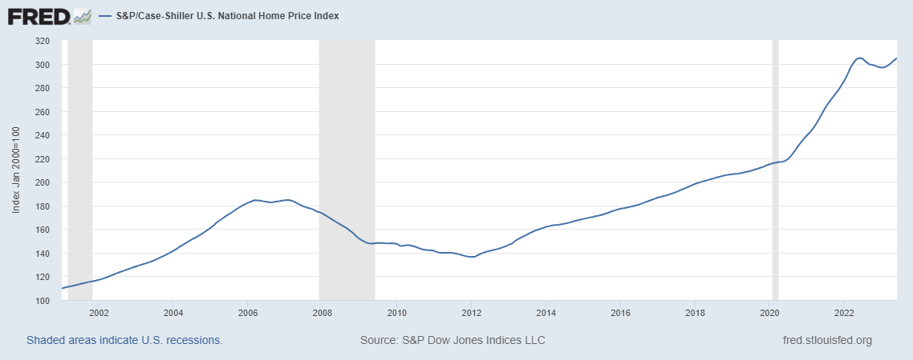

# Housing-Market-Analysis-For-USA

## Problem Statement

Find publicly available data for key factors that influence US home prices *nationally*. Then, build a data science model that explains how these factors impacted home prices over the last 20 years. Use the S&P Case-Schiller Home Price Index as a proxy for home prices.

## Overview
The housing market is influenced by the state of the economy, interest rates, real income and changes in the size of the population. As well as these demand-side factors, house prices will be determined by available supply. With periods of rising demand and limited supply, we will see rising house prices.

## Factors Affecting Housing Market
#### 1. Unemployment Rate 
The unemployment rate represents the number of unemployed as a percentage of the labor force.

#### 2. Median Household Income
Household income generally refers to the combined gross income of all members of a household above a specified age.

#### 3. Mortgage interest rate
A mortgage rate is the interest rate charged for a home loan.

#### 4. Inflation Rate
Inflation is the rate at which prices for goods and services rise.

#### 5. GDP per capita
Gross Domestic Product (GDP) per capita shows a country's GDP divided by its total population. GDP per capita provides a basic measure of the value of output per person, which is an indirect indicator of per capita income.

#### 6. Construction costs
Producer Price Index by Commodity for Construction Materials.  

#### 7. Monthly Supply of New Houses
The month's supply is the ratio of new houses for sale to new houses sold. This statistic provides an indication of the size of the new for-sale inventory in relation to the number of new houses currently being sold. The months' supply indicates how long the current new for-sale inventory would last given the current sales rate if no additional new houses were built.

#### 8. Working Population
Working Age Population for ages between 15-64 for all Persons in the United States in percentage.

#### 9. Housing Subsidies
Federal Government subsidies for Housing in million dollars.

#### 10. Number of Households
Total Households in the United States in thousands.

#### 11. Consumer Sentiments
Consumer sentiment is a statistical measurement of the overall health of the economy as determined by consumer opinion. It takes into account people's feelings toward their current financial health, the health of the economy in the short-term, and the prospects for longer-term economic growth, and is widely considered to be a useful economic indicator.

#### 12. Recession
In the United States, a recession is defined as a significant decline in economic activity spread across the market, lasting more than a few months, normally visible in real GDP, real income, employment, industrial production, and wholesale retail sales. whenever there is a recession people are more likely to spend less money and this affects the housing market to a large extent.

## Time-series Data for the Factors Affecting the Housing Market
1. Unemployment Rate - https://fred.stlouisfed.org/series/UNRATE
2. Median Household Income - https://fred.stlouisfed.org/series/MEHOINUSA646N
3. Mortgage interest rate - https://fred.stlouisfed.org/series/MORTGAGE30US
4. Inflation Rate - https://fred.stlouisfed.org/series/FPCPITOTLZGUSA
5. GDP per capita - https://fred.stlouisfed.org/series/A939RC0A052NBEA
6. Construction Prices - https://fred.stlouisfed.org/series/WPUSI012011
7. Monthly Supply of New Houses - https://fred.stlouisfed.org/series/MSACSR
8. Working Population - https://fred.stlouisfed.org/series/LFWA64TTUSM647S
9. Housing Subsidies - https://fred.stlouisfed.org/series/L312051A027NBEA
10. Number of Households - https://fred.stlouisfed.org/series/TTLHH
11. Consumer Sentiments - https://fred.stlouisfed.org/series/UMCSENT

## S&P/Case-Shiller U.S. National Home Price Index Graph

Link to [Case-Shiller Index](https://fred.stlouisfed.org/series/CSUSHPISA)

The S&P CoreLogic Case-Shiller U.S. National Home Price NSA Index measures the change in the value of the U.S. residential housing market by tracking the purchase prices of single-family homes. The index is compiled and published monthly. The national index is widely viewed as a barometer of the U.S. housing market and the broader economy.

## References

1. https://www.imf.org/en/Blogs/Articles/2023/03/14/house-prices-continue-to-fall-as-borrowing-costs-rise
2. https://www.economicshelp.org/blog/377/housing/factors-that-affect-the-housing-market/
3. https://www.bankrate.com/real-estate/interest-rates-housing/
4. https://www.atlantis-press.com/article/125971723.pdf
5. https://pvsbuilders.com/economic-factors-affecting-housing-market/
6. https://www.investopedia.com/articles/mortages-real-estate/11/factors-affecting-real-estate-market.asp
7. https://en.wikipedia.org/wiki/Recession

