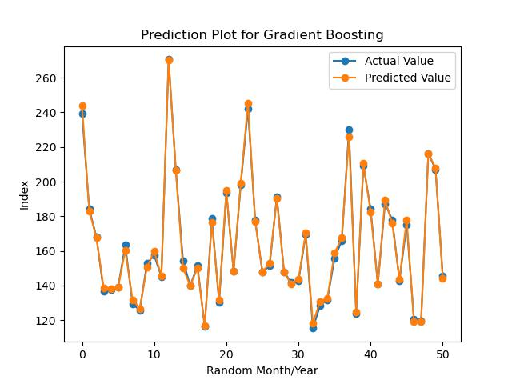
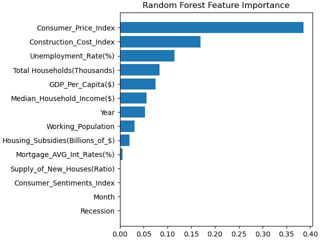

# Housing Market Research Analysis For USA

## Problem Statement

**Find publicly available data** for **key factors** that **influence US home prices nationally**. Then, **build** a **data science model** that **explains how these factors impacted home prices** over the last 20 years. Use the **S&P Case-Schiller Home Price Index** as a proxy for home prices.

## Overview
**The housing market** is **influenced** by the **state of the economy**, **interest rates**, **real income** and **construction costs**. As well as these demand-side factors, **house prices** will be **determined by available supply**. With periods of **rising demand** and **limited supply**, we will see **rising house prices**.

## Factors Affecting Housing Market
#### 1. Unemployment Rate 
The unemployment rate represents the number of unemployed as a percentage of the labor force.

#### 2. Median Household Income
Household income generally refers to the combined gross income of all members of a household above a specified age.

#### 3. Mortgage interest rate
A mortgage rate is the interest rate charged for a home loan.

#### 4. Inflation Rate
Inflation is the rate at which prices for goods and services rise. Consumer Price Index is one of the key indicator of Inflation.

#### 5. GDP per capita
Gross Domestic Product (GDP) per capita shows a country's GDP divided by its total population. GDP per capita provides a basic measure of the value of output per person, which is an indirect indicator of per capita income.

#### 6. Construction costs
Producer Price Index by Commodity for Construction Materials.  

#### 7. Monthly Supply of New Houses
The month's supply is the ratio of new houses for sale to new houses sold. This statistic provides an indication of the size of the new for-sale inventory in relation to the number of new houses currently being sold. The months' supply indicates how long the current new for-sale inventory would last given the current sales rate if no additional new houses were built.

#### 8. Working Population
Working Age Population for ages between 15-64 for all Persons in the United States.

#### 9. Housing Subsidies
Federal Government subsidies for Housing in the United States.

#### 10. Household Estimates
Total Households in the United States.

#### 11. Consumer Sentiments
Consumer sentiment is a statistical measurement of the overall health of the economy as determined by consumer opinion. It takes into account people's feelings toward their current financial health, the health of the economy in the short-term, and the prospects for longer-term economic growth, and is widely considered to be a useful economic indicator.

#### 12. Recession
In the United States, a recession is defined as a significant decline in economic activity spread across the market, lasting more than a few months, normally visible in real GDP, real income, employment, industrial production, and wholesale retail sales. whenever there is a recession people are more likely to spend less money and this affects the housing market to a large extent.

## S&P/Case-Shiller U.S. National Home Price Index

Link to [Case-Shiller Index](https://fred.stlouisfed.org/series/CSUSHPISA)

The **S&P CoreLogic Case-Shiller U.S. National Home Price NSA Index** measures the **change in the value** of the **U.S. residential housing market** by tracking the purchase prices of single-family homes. The **index** is **compiled** and **published monthly.** The **national index** is widely viewed as a **barometer of the U.S. housing market** and the broader economy.

We will use this **Index** as our **target in this project.**

## Problem Solving Approach

### Dataset
1. **No such dataset is readily available.** 
2. So we **need to do** a **little research** and **gather Time-Series data** for the last 20 years for all the **above factors** 
   mentioned.
3. We are **collecting data** from **Jan 2001 to Dec 2021** on a **monthly basis.**

### Machine Learning Model
1. Once we **gather all the Time-Series data** we will **put** them into **one andas Dataframe.**
2. We will use **12 factors affecting the housing market** as our **12 Features.**
3. Our **target output** will be **S&P Case-Schiller Home Price Index**.
4. Our **Machine Learning Model** will try to **predict** the **target value** by **establishing the relation between 12 features and the target value.**
5. We will use **XGBoost Regression Model** as it is a **Regression problem.**

### EDA and Feature Engineering

1. Collect all **12 features Time-Series data** and put them into **one folder.**
2. **Read** the individual **data file.**
3. Make the **DATE column** as **pandas DATETIME** and keep only **Month** and **Year.**
4. **Rename** the **information column** from Time-Series data.
5. Convert **GPD, House_Subsidies and Median_Household_Income** data from **annual to monthly.**
6. Convert *Mortgage Interest rate** from **weekly to monthly** by taking **average.**
7. Create a Excel file for **Recession** by making, **1 for Recession** and **0 for No Recession**, for Recession month and year between **Jan 2011 to Dec 2021.**
8. Add **Recession** as a **new feature.**
9. **Merge** all **12 features** into one **Dataframe** using the DATE column.
10. Make **Month** and **Year** as **two new features.**
11. **Delete** the **DATE column** as we no longer need it.
12. Plot the **Boxplot** to find out **Outliners.**
13. Plot the **Heatmap** to **visualize the strength of correlation among variables.**
14. Use **info()** to make sure that **all features** are **numeric** and all **null** values are **removed.**

**Note: Since we have a small dataset and fewer features we will go for Gradient Boosting Regressor or Random Forest Regressor**

## Model fitting using Gradient Boosting Regressor

#### For the Regression model, evaluation should be done using Mean Absolute Percentage Error

1. **Split** the **dataset** into **train** and **test** sets.
2. **Gradient Boosting Regressor does not require any feature scaling.**
3. **Import** and **fit the model.**
4. **Evaluate** the **loss on mean absolute error.**
5. **Predict** for **test** data.
6. **Evaluate** the **mean absolute percentage error** between **y_test and y_pred.**
7. **Plot** the all samples from **y_test and y_pred.**
8. **Plot Feature Importance.**

## Gradient Boosting Regressor Performance
**Percentage Accuracy on Test data is 98.86 %**

**The mean Absolute Percentage Error on Test data is 1.14 %**

## Result Plot for Gradient Boosting - Actual Value and Predicted Value

## Feature Importance Plot for Gradient Boosting

## Model fitting using Random Forest Regressor 

#### For the Regression model, evaluation should be done using Mean Absolute Percentage Error

1. **Split** the **dataset** into **train** and **test** sets.
2. **Random Forest Regressor does not require any feature scaling.**
3. **Import** and **fit the model.**
4. **Evaluate** the **loss on mean absolute error.**
5. **Predict** for **test** data.
6. **Evaluate** the **mean absolute percentage error** between **y_test and y_pred.**
7. **Plot** the all samples from **y_test and y_pred.**
8. **Plot Feature Importance.**

## Random Forest Regressor Performance
**Percentage Accuracy on Test data is 99.27 %**

**The mean Absolute Percentage Error on Test data is 0.73 %**

## Result Plot for Random Forest - Actual Value and Predicted Value

## Feature Importance Plot for Random Forest

## Conclusion
**Both Random Forest and Gradient Boosting are performing well whereas Random Forest is performing slightly better than Gradient Boosting in this project. We can also observe that the importance given to features by both algorithms also slightly varies.** 

## Time-series Data for the Factors Affecting the Housing Market
1. Unemployment Rate - https://fred.stlouisfed.org/series/UNRATE
2. Median Household Income - https://fred.stlouisfed.org/series/MEHOINUSA646N
3. Mortgage interest rate - https://fred.stlouisfed.org/series/MORTGAGE30US
4. Inflation Rate - https://fred.stlouisfed.org/series/CPALTT01USM661S
5. GDP per capita - https://fred.stlouisfed.org/series/A939RC0A052NBEA
6. Construction Prices - https://fred.stlouisfed.org/series/WPUSI012011
7. Monthly Supply of New Houses - https://fred.stlouisfed.org/series/MSACSR
8. Working Population - https://fred.stlouisfed.org/series/LFWA64TTUSM647S
9. Housing Subsidies - https://fred.stlouisfed.org/series/L312051A027NBEA
10. Number of Households - https://fred.stlouisfed.org/series/TTLHH
11. Consumer Sentiments - https://fred.stlouisfed.org/series/UMCSENT
12. Recession Time - https://en.wikipedia.org/wiki/List_of_recessions_in_the_United_States

## References

1. https://www.imf.org/en/Blogs/Articles/2023/03/14/house-prices-continue-to-fall-as-borrowing-costs-rise
2. https://www.economicshelp.org/blog/377/housing/factors-that-affect-the-housing-market/
3. https://www.bankrate.com/real-estate/interest-rates-housing/
4. https://www.atlantis-press.com/article/125971723.pdf
5. https://pvsbuilders.com/economic-factors-affecting-housing-market/
6. https://www.investopedia.com/articles/mortages-real-estate/11/factors-affecting-real-estate-market.asp 
7. https://en.wikipedia.org/wiki/Recession

